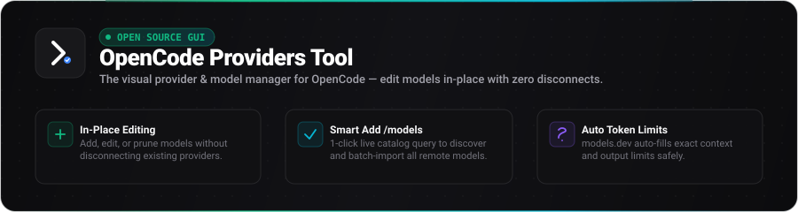
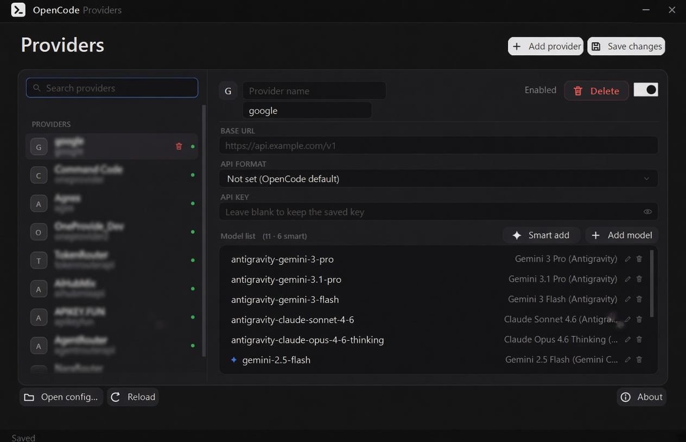
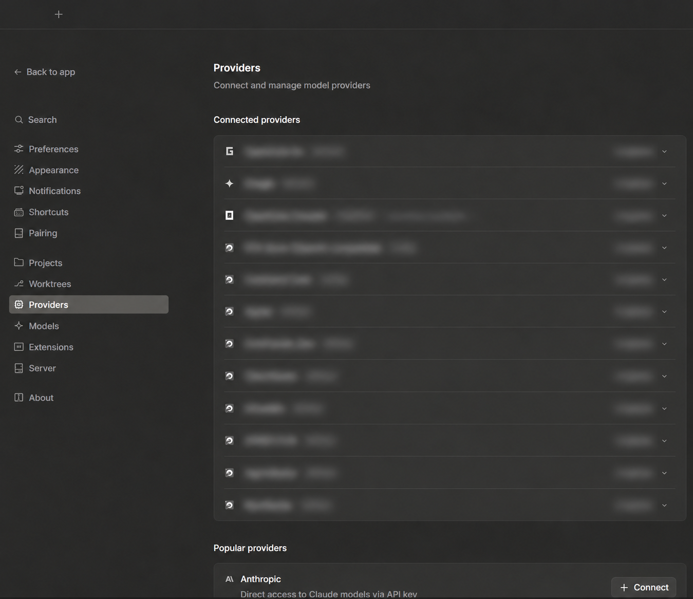

<div align="center">
  <a href="https://uranrog-01.github.io/opencode_providers/">
    
  </a>

  <br /><br />

  <p>
    <a href="https://github.com/uranrog-01/opencode_providers/releases/latest"></a>
    <a href="https://github.com/uranrog-01/opencode_providers/releases"></a>
    <a href="https://www.virustotal.com/gui/file/965a31b4cc005e6f8f268b78e099f8ef7b6a13d29dc6c305e08daa67028e9bd1?nocache=1"></a>
    <a href="LICENSE"></a>
  </p>

  <p>
    <a href="https://github.com/uranrog-01/opencode_providers/releases/latest/download/OpenCodeProvidersTool.exe"><b>⚡ Download Portable .exe (~870 KB)</b></a> &nbsp;&bull;&nbsp;
    <a href="https://uranrog-01.github.io/opencode_providers/"><b>🌐 Product Website</b></a> &nbsp;&bull;&nbsp;
    <a href="https://www.virustotal.com/gui/file/965a31b4cc005e6f8f268b78e099f8ef7b6a13d29dc6c305e08daa67028e9bd1?nocache=1"><b>🛡️ VirusTotal Clean Report</b></a>
  </p>

  <br />

  <a href="https://github.com/uranrog-01/opencode_providers/releases/latest/download/OpenCodeProvidersTool.exe">
    
  </a>
</div>

<br />

---

### The Problem & The Solution

> [!IMPORTANT]
> **The Core Problem in OpenCode:**
> In [OpenCode](https://opencode.ai)'s native settings, once a provider is connected, you **cannot edit, add, or prune its models without disconnecting the entire provider** or manually editing delicate `.jsonc` files. Hand-editing risks syntax mistakes, erased comments, and broken token limit configurations.

> [!TIP]
> **The Solution — OpenCode Providers Tool:**
> Edit any provider **in-place** with zero disconnects. Add new models, tweak limits, import live catalogs via <kbd>Smart Add</kbd>, and save directly with automated `.bak` backups while preserving 100% of your comments.

<div align="center">
  <p><sub><b>OpenCode Providers View — easily configured and managed via OpenCode Providers Tool:</b></sub></p>
  
</div>

<br />

---

### Key Capabilities

* 🔄 **In-Place Provider Editing** — Modify existing providers directly. Add, rename, or delete models without disconnecting or re-authenticating.
* ⚡ **Smart Add Live Model Catalog** — Query live `{baseURL}/models` endpoints with one click and batch-import models automatically.
* 🎯 **Intelligent Token Limits** — Auto-populates exact context and output limits powered by [models.dev](https://models.dev) with manual override controls.
* 🛡️ **Comment-Safe JSONC Engine** — Preserves all existing `//` line comments, `/* */` block comments, and custom structure.
* 💾 **Automatic Safety Backups** — Generates a timestamped `.bak` copy of your configuration file before every save.
* 🔒 **100% Local & Private** — Single portable executable with zero network telemetry. API keys never leave your machine.

---

### Visual Workflow

#### 1 · Select & Edit Providers In-Place
Choose any existing provider from the left panel. View its models, API key, base URL, and active state without disconnecting.

#### 2 · Smart Add Models from Live Endpoints
Hit <kbd>Smart Add</kbd> to fetch all available models directly from your provider's live endpoint:

<div align="center">
  
</div>

<br />

#### 3 · Auto-Sync Token Limits & Options
Models.dev database auto-fills context and output token limits with single-click precision:

<div align="center">
  
</div>

<br />

#### 4 · Instantly Active in OpenCode
Save changes (<kbd>Ctrl + S</kbd>) and switch to OpenCode — all models and providers are immediately ready to use.

---

### Feature Comparison

| Capability | Hand-Editing `.jsonc` | Native OpenCode UI | OpenCode Providers Tool |
| :--- | :--- | :--- | :--- |
| **Edit Connected Providers** | ⚠️ Risky raw file edits | ❌ Requires Disconnecting | **✅ In-Place (Zero Disconnects)** |
| **Add / Prune Models** | ⚠️ Manual copy-pasting | ❌ Not supported | **✅ 1-Click Visual Management** |
| **Live Model Discovery** | ❌ Check provider docs | ❌ None | **✅ Live `{baseURL}/models` Query** |
| **Token Limits Auto-Fill** | ❌ Guess / search specs | ❌ None | **✅ Auto-Filled via models.dev** |
| **Comment Preservation** | ❌ Formatters strip them | ❌ Overwritten | **✅ 100% Comment-Safe Engine** |
| **Safety Backups** | ❌ Manual copies only | ❌ None | **✅ Automatic `.bak` on every save** |

---

### Quick Installation

Open PowerShell and run:

```powershell
irm https://github.com/uranrog-01/opencode_providers/releases/latest/download/OpenCodeProvidersTool.exe -OutFile OpenCodeProvidersTool.exe
.\OpenCodeProvidersTool.exe
```

* **Standalone Portable Executable** (~870 KB)
* **Zero Dependencies** — Runs on .NET Framework 4.8 (pre-installed on Windows 10 & 11)
* **No Administrative Rights Required**

---

### Frequently Asked Questions

<details>
<summary><b>Does this tool modify or transmit my API keys?</b></summary>
<br />
<b>No.</b> The tool runs 100% locally on your machine. API keys are stored only in your local OpenCode config file and are only transmitted directly to your configured provider endpoints when querying models.
</details>

<details>
<summary><b>What happens to my comments in <code>config.jsonc</code>?</b></summary>
<br />
All comments (both <code>//</code> single-line and <code>/* */</code> multi-line) are completely preserved. The custom JSONC parser reads and writes around comments without stripping or reformatting them.
</details>

<details>
<summary><b>Can I restore a previous configuration if I make a mistake?</b></summary>
<br />
Yes! Every time you save, a timestamped <code>.bak</code> copy is automatically generated in your OpenCode configuration directory before any changes are written.
</details>

---

### Privacy & Security

* **Local Execution Only:** Operates entirely on your local machine with no external tracking or cloud relays.
* **Direct Connections Only:** API keys are sent strictly to your specified provider endpoints when querying models.
* **VirusTotal Verified:** Scanned and verified **0/72 Clean** on [VirusTotal](https://www.virustotal.com/gui/file/965a31b4cc005e6f8f268b78e099f8ef7b6a13d29dc6c305e08daa67028e9bd1?nocache=1).

---

### Build from Source

```bash
git clone https://github.com/uranrog-01/opencode_providers.git
cd opencode_providers/OpenCodeProvidersTool
dotnet build -c Release -o ..\release
```

*Prerequisite:* [.NET SDK 8.0+](https://dotnet.microsoft.com/download)

---

<div align="center">
  <p>Open source under the <a href="LICENSE">MIT License</a> &bull; Created by <b>zer0ne</b></p>
  <p><sub>Not affiliated with OpenCode. All edits are performed locally on your machine.</sub></p>
</div>
