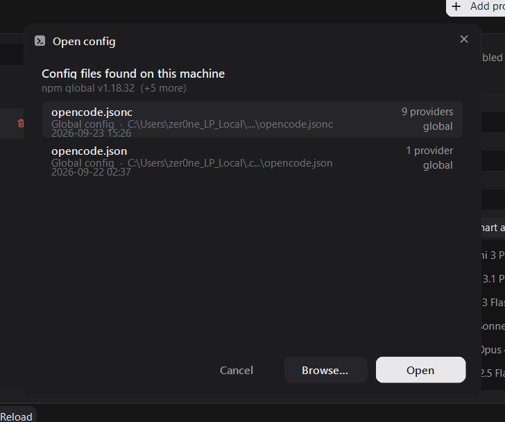

# OpenCode Providers Tool

**A modern, lightweight Windows desktop tool for OpenCode: easily add AI providers, configure API keys, import live model catalogs, and auto-sync token limits.**

[](https://github.com/uranrog-01/opencode_providers/releases)
[](LICENSE)
[](https://github.com/uranrog-01/opencode_providers/releases)
[-purple?style=flat-square)](https://github.com/uranrog-01/opencode_providers)
[](https://github.com/uranrog-01/opencode_providers/actions/workflows/ci.yml)
[](https://uranrog-01.github.io/opencode_providers/)
[-brightgreen?style=flat-square&logo=virustotal)](https://www.virustotal.com/gui/file/965a31b4cc005e6f8f268b78e099f8ef7b6a13d29dc6c305e08daa67028e9bd1?nocache=1)
[](https://hybrid-analysis.com/sample/965a31b4cc005e6f8f268b78e099f8ef7b6a13d29dc6c305e08daa67028e9bd1)

---

**[Download for Windows (v1.0.0)](https://github.com/uranrog-01/opencode_providers/releases/latest/download/OpenCodeProvidersTool.exe) • [Product Website](https://uranrog-01.github.io/opencode_providers/) • [VirusTotal Report](https://www.virustotal.com/gui/file/965a31b4cc005e6f8f268b78e099f8ef7b6a13d29dc6c305e08daa67028e9bd1?nocache=1) • [Hybrid Analysis](https://hybrid-analysis.com/sample/965a31b4cc005e6f8f268b78e099f8ef7b6a13d29dc6c305e08daa67028e9bd1)**

---


---

## ⚡ Overview

[OpenCode](https://github.com/opencode-ai) uses a `.jsonc` configuration file to define AI providers, credentials, and model limits. While flexible, hand-editing this file presents constant friction:

* **Syntax Fragility:** One missing comma, broken quote, or invalid JSON structure prevents OpenCode from launching.
* **Token Limit Mismatches:** OpenCode strictly requires both `limit.context` and `limit.output` on any model declaring limits. If one is missing, OpenCode rejects the config.
* **Lost Comments:** Standard JSON formatters wipe your documentation comments (`// ...`) on save.
* **Tedious Model Typing:** Manually copy-pasting dozens of model IDs (e.g. `deepseek/deepseek-chat-v3`, `claude-3-7-sonnet-20250219`) leads to frequent typos.

**OpenCode Providers Tool** is a dedicated, zero-install Windows desktop application that solves this completely. It gives you a clean visual dashboard to manage providers and API keys, automatically pulls live model lists from vendor endpoints, and syncs verified token limits via [models.dev](https://models.dev).

---

## 🚀 Key Features

| Feature | Description |
| :--- | :--- |
| 🔑 **Effortless Provider & API Key Setup** | Add popular or custom providers (DeepSeek, OpenRouter, Groq, Ollama, Anthropic, relays). Includes a direct **"Get API Key"** link to vendor token pages, masked keys with reveal toggle, and safe blank-field retention. |
| ⚡ **1-Click Smart Add** | Connects directly to `{baseURL}/models` using your API key. Pulls every model your endpoint serves into a clean interactive checklist for instant bulk addition. |
| 🧠 **Smart Token Limits (models.dev)** | Auto-resolves Context Window (`limit.context`) and Max Output Tokens (`limit.output`). Visual `auto` vs `manual` indicators ensure custom numbers are never overwritten. |
| 🛡️ **Zero-Loss JSONC Engine** | Custom parser preserves your `.jsonc` comments, maintains `enabled_providers` / `disabled_providers` whitelists, and keeps untouched keys (`modalities`, `cost`, `plugin`) intact. |
| 💾 **Automatic `.bak` Backups** | Every write automatically duplicates your config to `<filename>.bak` first. You can never lose a working setup. |
| 🔍 **Automatic System Discovery** | Detects OpenCode installations (CLI, Electron Desktop, npm, bun, scoop, winget) and lists every config on your PC. |
| 📦 **Single Portable Executable** | Weighs ~870 KB. Zero installer, zero external dependencies (`Newtonsoft.Json.dll` is embedded inside the .exe), targets pre-installed .NET Framework 4.8. |
| 🔒 **100% Private & Open Source** | Zero telemetry, zero tracking. All credentials stay strictly on your local PC. MIT Licensed. |

---

## 🛡️ Security & Clean Antivirus Verification

Trust and security are paramount when managing API credentials and development tools. The compiled release binary has been scanned across top malware analysis sandboxes with **100% clean detections**:

* **VirusTotal Detection:** **0 / 72 Security Vendors (Clean)**
  * [View Live VirusTotal Analysis](https://www.virustotal.com/gui/file/965a31b4cc005e6f8f268b78e099f8ef7b6a13d29dc6c305e08daa67028e9bd1?nocache=1)
* **Hybrid Analysis Score:** **100 / 100 Clean (No Threat Detected)**
  * [View Live Hybrid Analysis Sandbox Report](https://hybrid-analysis.com/sample/965a31b4cc005e6f8f268b78e099f8ef7b6a13d29dc6c305e08daa67028e9bd1)
* **Target SHA-256 Checksum:**
  `965a31b4cc005e6f8f268b78e099f8ef7b6a13d29dc6c305e08daa67028e9bd1`

To verify the checksum of your downloaded binary on Windows PowerShell:

```powershell
Get-FileHash OpenCodeProvidersTool.exe -Algorithm SHA256
```

---

## 📸 Visual Walkthrough: How the Workflow Works

### Step 1: Add Any Provider & Configure API Key

Select from pre-configured providers or add a custom provider ID.

* Click **Get API Key** to open the provider's token generation page in your browser.
* Paste your key into the masked input (toggle visibility with the eye icon).
* Configure the Base URL and API format (e.g. `@ai-sdk/anthropic`, `openai`, etc.).
* Use the toggle switch to easily enable or disable providers without deleting them.


---

### Step 2: 1-Click Smart Add for Models

Stop typing long model names manually. Click **Smart add** next to the model list:

* The tool queries the provider's live `{baseURL}/models` endpoint using your API key.
* Differentiates **new** models from already **added** ones.
* Select all or check specific models to add them in bulk.
* If the endpoint cannot be reached or is private, it automatically falls back to verified models from models.dev.


---

### Step 3: Smart Configuration & Token Limits (models.dev)

OpenCode requires both Context Window (`limit.context`) and Max Output Tokens (`limit.output`):

* When you add or edit a model, **Smart configuration** queries the [models.dev](https://models.dev) catalog.
* It matches by model ID (including relay prefixes like `z-ai/glm` → `zhipuai/glm`), Base URL host, and npm format.
* Fields are clearly tagged as **auto** or **manual**. Editing any number marks only that field as manual; the others stay auto-synced.
* Click **Reset form** anytime to clear manual overrides and restore recommendations.


---

### Step 4: Machine Config Discovery

Don't worry about finding where OpenCode stored its configuration:

* The tool automatically scans standard paths: `%USERPROFILE%\.config\opencode\opencode.jsonc`, portable folders, and Electron desktop locations.
* Click **Open config…** to inspect every config found on your machine with provider counts, file kind, and modification dates.



---

### Step 5: Active & Connected in OpenCode

Once saved, every provider and model immediately reflects inside OpenCode's native **Connected providers** interface:

* **Custom Relays & Routers:** Effortlessly manage endpoints like `TokenRouter`, `AiHubMix`, `AgentRouter`, `NaraRouter`, `APIKEY.FUN`, and OpenAI-compatible relays.
* **Instant Model Availability:** All configured models show up ready for prompt sessions and coding workflows in OpenCode.
* **Zero Syntax Errors:** OpenCode reads the clean, schema-validated `.jsonc` file without startup failures.


---

## 🏗️ Technical Architecture: How It Works

The application is engineered with safety as its primary constraint. Here is the operational workflow:

```mermaid
flowchart TD
    A[Launch OpenCodeProvidersTool.exe] --> B[OpenCodeLocator: Scan System & Path]
    B --> C[Locate Global Config or Custom Target]
    C --> D[ConfigComments: Parse JSONC & Extract Comments Map]
    D --> E[ConfigStore: Load Providers & Model Metadata]
    E --> F[MainForm: Display UI & Status Indicators]
    
    F --> G[Action: Add / Edit Provider & API Key]
    F --> H[Action: Smart Add Live {baseURL}/models]
    F --> I[Action: Smart Limits via models.dev Cache]
    
    G --> J[Unsaved State Tracker Active]
    H --> J
    I --> J
    
    J --> K[User Clicks Save Changes]
    K --> L[Step 1: Write <filename>.bak Backup]
    K --> M[Step 2: Enforce Limit Pairs context + output]
    K --> N[Step 3: Re-inject Preserved JSONC Comments]
    K --> O[Step 4: Atomically Write opencode.jsonc]
```

### Component Analysis

| Source File | Role & Architecture |
| :--- | :--- |
| [Program.cs](OpenCodeProvidersTool/Program.cs) | Application entry point, CLI arguments parsing, embedded resource resolver (`Newtonsoft.Json.dll`), and unhandled exception safety logging. |
| [MainForm.cs](OpenCodeProvidersTool/MainForm.cs) | The main provider editor: searchable list, provider details, masked API keys, model table, and unsaved state tracking. |
| [Dialogs.cs](OpenCodeProvidersTool/Dialogs.cs) | Custom-rendered floating dialogs: Smart Configuration editor, Smart Add multi-select, and confirmation prompts. |
| [ModelDiscovery.cs](OpenCodeProvidersTool/ModelDiscovery.cs) | Direct HTTP client for provider `{baseURL}/models` endpoints. Handles diverse JSON response schemas (data arrays, models maps, Google format). |
| [ModelCatalog.cs](OpenCodeProvidersTool/ModelCatalog.cs) | Client for [models.dev](https://models.dev). Provides 12-hour local caching, prefix matching, punctuation folding, and limit recommendations. |
| [SmartState.cs](OpenCodeProvidersTool/SmartState.cs) | Tracks `auto` vs `manual` state per model in local app data without dirtying the OpenCode config file. |
| [ConfigComments.cs](OpenCodeProvidersTool/ConfigComments.cs) | Captures JSONC comments by property key and re-injects them during serialization, preventing comment loss. |
| [ConfigStore.cs](OpenCodeProvidersTool/ConfigStore.cs) | Core document store: round-trips JSON, maintains `enabled_providers` whitelist, and creates `.bak` backups before write. |
| [OpenCodeLocator.cs](OpenCodeProvidersTool/OpenCodeLocator.cs) | Discovers OpenCode CLI, Electron Desktop apps, npm/bun/scoop/winget packages, and config locations. |
| [Theme.cs](OpenCodeProvidersTool/Theme.cs) & [Icons.cs](OpenCodeProvidersTool/Icons.cs) | Dark theme design system, DPI scaling helpers, and vector icon rendering. |

---

## 💻 Quick Installation & Run

### Method 1: Direct Download (Recommended)

Download the latest standalone executable from GitHub Releases:

* 📥 [**Download OpenCodeProvidersTool.exe**](https://github.com/uranrog-01/opencode_providers/releases/latest/download/OpenCodeProvidersTool.exe)

No installation required. Double-click to launch.

### Method 2: PowerShell

Run this one-liner to download and place the tool in your current directory:

```powershell
irm https://github.com/uranrog-01/opencode_providers/releases/latest/download/OpenCodeProvidersTool.exe -OutFile OpenCodeProvidersTool.exe
.\OpenCodeProvidersTool.exe
```

### Method 3: Target a Specific Config

To open a custom or project-specific config directly:

```cmd
OpenCodeProvidersTool.exe "C:\path\to\opencode.jsonc"
```

---

## 🛠️ Build from Source

Requirements: [.NET SDK 8.0+](https://dotnet.microsoft.com/download) (targeting .NET Framework 4.8 via `Microsoft.NETFramework.ReferenceAssemblies`).

```bash
# Clone the repository
git clone https://github.com/uranrog-01/opencode_providers.git
cd opencode_providers/OpenCodeProvidersTool

# Build the single-file executable
dotnet build -c Release -o ..\release
```

### Run Self-Tests

Verify config round-trip integrity, comment retention, and models.dev matching:

```bash
cd ../selftest
dotnet run -c Release -- ..\samples\opencode.sample.jsonc
```

### Run UI Off-Screen Tests

Verify dialog layouts, button actions, and mock catalog queries:

```bash
cd ../uitest
dotnet run -c Release
```

---

## 📄 License & Attribution

* **License:** MIT License — see [LICENSE](LICENSE) for full details.
* **Author:** Developed by **zer0ne**.
* **Disclaimer:** OpenCode Providers Tool is an independent, open-source community utility and is not officially affiliated with OpenCode. All configuration modifications are performed locally with automatic backups.
