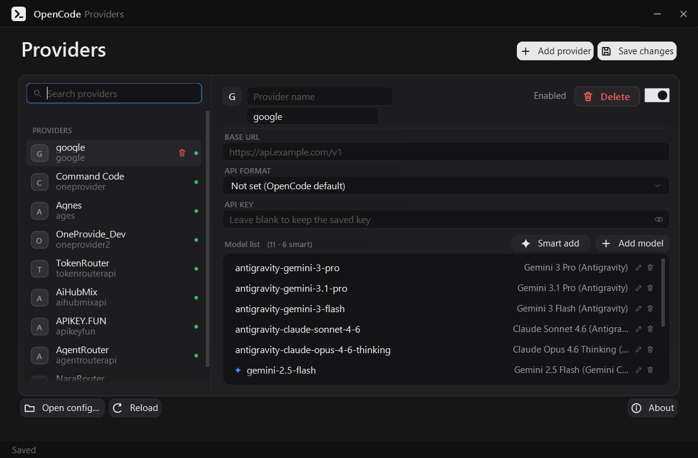
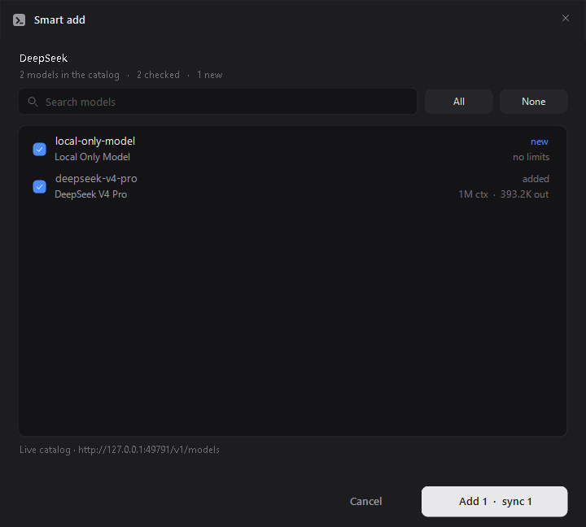
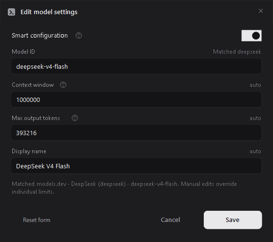
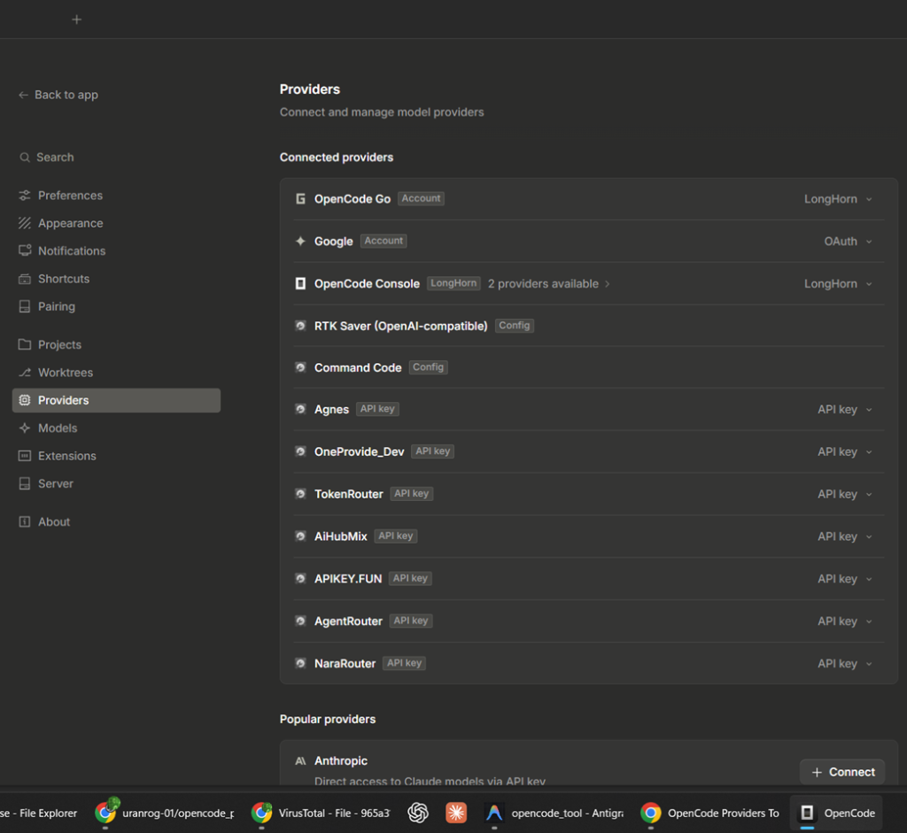

<p align="center">
  <a href="https://uranrog-01.github.io/opencode_providers/">
    
  </a>
</p>

<h1 align="center">OpenCode Providers Tool</h1>

<p align="center">A fast, visual provider and model editor for <a href="https://opencode.ai">OpenCode</a>.</p>
<p align="center"><b>Add, edit, or remove models on existing providers without ever disconnecting them.</b></p>

<p align="center">
  <a href="https://github.com/uranrog-01/opencode_providers/releases"></a>
  <a href="LICENSE"></a>
  <a href="https://www.virustotal.com/gui/file/965a31b4cc005e6f8f268b78e099f8ef7b6a13d29dc6c305e08daa67028e9bd1?nocache=1"></a>
  <a href="https://github.com/uranrog-01/opencode_providers/releases"></a>
</p>

<p align="center">
  <a href="https://github.com/uranrog-01/opencode_providers/releases/latest/download/OpenCodeProvidersTool.exe"><b>Download .exe</b></a> &bull;
  <a href="https://uranrog-01.github.io/opencode_providers/"><b>Website</b></a> &bull;
  <a href="https://www.virustotal.com/gui/file/965a31b4cc005e6f8f268b78e099f8ef7b6a13d29dc6c305e08daa67028e9bd1?nocache=1"><b>VirusTotal (0/72 Clean)</b></a>
</p>

<br />

<p align="center">
  
</p>

---

### Installation

Download the single standalone executable directly from [Releases](https://github.com/uranrog-01/opencode_providers/releases), or run via PowerShell:

```powershell
irm https://github.com/uranrog-01/opencode_providers/releases/latest/download/OpenCodeProvidersTool.exe -OutFile OpenCodeProvidersTool.exe
.\OpenCodeProvidersTool.exe
```

> **Note:** Portable single-file binary (~870 KB). No installer, no background services, runs instantly.

---

### What is OpenCode Providers Tool?

**OpenCode Providers Tool** is an open-source visual manager for [OpenCode](https://opencode.ai) configuration. Instead of manually editing fragile `.jsonc` files by hand, it lets you configure providers, add API keys, and discover live models in seconds.

* `[*]` **In-Place Provider Editing** — Add, remove, or edit models on any existing provider without disconnecting or re-authenticating it in OpenCode.
* `[*]` **1-Click Live Discovery** — Query `{baseURL}/models` directly with your API key to fetch and import models in bulk.
* `[*]` **models.dev Limits Auto-Sync** — Automatically populates accurate context window (`limit.context`) and output limits (`limit.output`).
* `[*]` **Comment & Structure Preservation** — Safe `.jsonc` engine ensures your handwritten comments and formatting never get wiped.
* `[*]` **Automatic Backups** — Creates a timestamped `.bak` copy of your configuration before every save.
* `[*]` **100% Private & Local** — Zero telemetry, zero external relays. Your keys stay entirely on your device.

---

### Edit Providers Without Disconnecting

In OpenCode's native settings, modifying an already connected provider is frustrating. Adding a newly released model, pruning deprecated models, or adjusting token limits normally forces you to disconnect the provider completely or edit complex `.jsonc` files by hand.

**OpenCode Providers Tool** makes managing existing providers effortless:

* `[*]` **Add New Models** — Pull newly released models via **Smart add** or enter model IDs directly on any active provider without resetting it.
* `[*]` **Remove Deprecated Models** — Delete obsolete models with one click while keeping your provider credentials intact.
* `[*]` **Edit Existing Models** — Fine-tune token limits or model names in-place without re-entering API keys.
* `[*]` **Zero Disconnects** — Your provider remains continuously connected and active in OpenCode's **Connected providers** screen.

---

### How It Works

#### 1. Configure Providers & API Keys

Add any provider (DeepSeek, OpenRouter, Groq, Ollama, Anthropic, or custom endpoints). Keys are masked by default with an instant reveal toggle, and blank fields never overwrite existing secrets.

#### 2. Live Model Discovery

Skip copying and pasting model IDs manually. Click **Smart add** to fetch the live model catalog directly from the provider's endpoint:

<p align="center">
  
</p>

#### 3. Automatic Token Limits via models.dev

OpenCode requires verified token limits for reliable operation. Context window and output limits are automatically populated via [models.dev](https://models.dev), with manual overrides when needed:

<p align="center">
  
</p>

#### 4. Connected in OpenCode

Save your changes and launch OpenCode. Your configured providers immediately appear under OpenCode's native **Connected providers** screen:

<p align="center">
  
</p>

---

### Raw JSON vs. OpenCode Providers Tool

| Feature | Manual `.jsonc` Editing | OpenCode Providers Tool |
| :--- | :--- | :--- |
| **Updating Models on a Provider** | Disconnect provider or edit raw JSON | **Edit in-place:** add, edit, or remove models without disconnecting |
| **Model Discovery** | Manual copy-paste of IDs | 1-Click live `/models` query |
| **Token Limits** | Guessing or searching docs | Auto-populated from models.dev |
| **Comment Safety** | Frequently wiped by JSON formatters | 100% preserved |
| **Syntax Errors** | Trailing commas break OpenCode | Validated visual editor |
| **Safety Backups** | Manual copy-pasting | Automatic `.bak` backup before every save |

---

### Privacy & Security

* `[*]` **Local Execution** — Standalone .NET application that runs purely on your local machine.
* `[*]` **No External Relays** — Network traffic is strictly limited to your configured provider endpoints and public `models.dev` lookups.
* `[*]` **Antivirus Clean** — Verified **0/72 Clean** on [VirusTotal](https://www.virustotal.com/gui/file/965a31b4cc005e6f8f268b78e099f8ef7b6a13d29dc6c305e08daa67028e9bd1?nocache=1).

---

### Build from Source

Requires [.NET SDK 8.0+](https://dotnet.microsoft.com/download):

```bash
git clone https://github.com/uranrog-01/opencode_providers.git
cd opencode_providers/OpenCodeProvidersTool
dotnet build -c Release -o ..\release
```

---

### License

Open source under the [MIT License](LICENSE). Created by **zer0ne**.  
*Not affiliated with OpenCode. All configuration edits are performed locally.*
