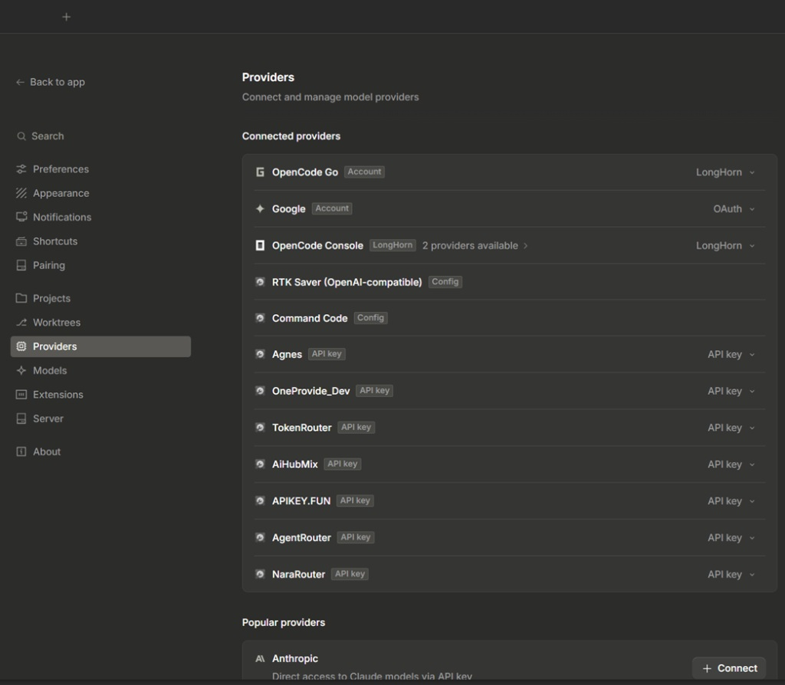

<p align="center">
  <a href="https://uranrog-01.github.io/opencode_providers/">
    
  </a>
</p>

<h3 align="center">OpenCode Providers Tool</h3>

<p align="center">
  <em>The visual provider &amp; model editor for <a href="https://opencode.ai">OpenCode</a>.</em><br />
  Add, edit, or remove models on existing providers — without ever disconnecting them.
</p>

<p align="center">
  <a href="https://github.com/uranrog-01/opencode_providers/releases"></a>
  <a href="LICENSE"></a>
  <a href="https://www.virustotal.com/gui/file/965a31b4cc005e6f8f268b78e099f8ef7b6a13d29dc6c305e08daa67028e9bd1?nocache=1"></a>
  <a href="https://github.com/uranrog-01/opencode_providers/releases"></a>
</p>

<br />

<p align="center">
  <a href="https://github.com/uranrog-01/opencode_providers/releases/latest/download/OpenCodeProvidersTool.exe"></a>
</p>

<p align="center">
  <a href="https://github.com/uranrog-01/opencode_providers/releases/latest/download/OpenCodeProvidersTool.exe"><b>Download</b></a> · <a href="https://uranrog-01.github.io/opencode_providers/"><b>Website</b></a> · <a href="https://www.virustotal.com/gui/file/965a31b4cc005e6f8f268b78e099f8ef7b6a13d29dc6c305e08daa67028e9bd1?nocache=1"><b>VirusTotal Report</b></a>
</p>

---

### Installation

```powershell
irm https://github.com/uranrog-01/opencode_providers/releases/latest/download/OpenCodeProvidersTool.exe -OutFile OpenCodeProvidersTool.exe
.\OpenCodeProvidersTool.exe
```

Single portable `.exe` (~870 KB). No installer needed — runs on .NET Framework 4.8 (pre-installed on Windows 10/11).

---

### Why?

OpenCode reads providers and models from a `.jsonc` config file. Editing it by hand is fragile — missing token limits break sessions, JSON formatters destroy your comments, and typos in model IDs waste time.

This tool replaces all of that with a visual editor.

- `[*]` **Edit providers in-place** — add, remove, or modify models on any connected provider without disconnecting it
- `[*]` **Smart Add** — query your provider's live `/models` endpoint and import models in bulk
- `[*]` **Auto token limits** — context and output limits auto-populated via [models.dev](https://models.dev)
- `[*]` **Comment-safe** — custom JSONC engine preserves all your `//` comments exactly where they are
- `[*]` **Automatic backups** — `.bak` copy created before every save
- `[*]` **Fully local** — zero telemetry, keys never leave your machine

---

### How It Works

**1 · Add or select a provider** → configure API key, base URL, enable/disable toggle

**2 · Smart Add models** → fetches the live model catalog from `{baseURL}/models`

<p align="center">
  
</p>

**3 · Auto-sync limits** → token limits populated from models.dev with auto/manual control

<p align="center">
  
</p>

**4 · Connected in OpenCode** → save and your providers appear instantly

<p align="center">
  
</p>

---

### Comparison

| | Hand-editing `.jsonc` | OpenCode Providers Tool |
|:---|:---|:---|
| **Editing existing providers** | Disconnect or risk raw JSON errors | Edit models in-place, zero disconnects |
| **Adding models** | Copy-paste IDs one by one | 1-click live `/models` import |
| **Token limits** | Guess or search docs | Auto-filled from models.dev |
| **Comments** | Wiped by JSON formatters | 100% preserved |
| **Backups** | Manual | Automatic `.bak` on every save |

---

### Privacy & Security

- `[*]` Runs entirely on your local machine — no cloud backend
- `[*]` API keys are only sent to your configured provider endpoints
- `[*]` Verified **0/72 Clean** on [VirusTotal](https://www.virustotal.com/gui/file/965a31b4cc005e6f8f268b78e099f8ef7b6a13d29dc6c305e08daa67028e9bd1?nocache=1)

---

### Build from Source

```bash
git clone https://github.com/uranrog-01/opencode_providers.git
cd opencode_providers/OpenCodeProvidersTool
dotnet build -c Release -o ..\release
```

Requires [.NET SDK 8.0+](https://dotnet.microsoft.com/download).

---

<p align="center">
  Open source under the <a href="LICENSE">MIT License</a>. Created by <b>zer0ne</b>.<br />
  <sub>Not affiliated with OpenCode. All edits are performed locally on your machine.</sub>
</p>
